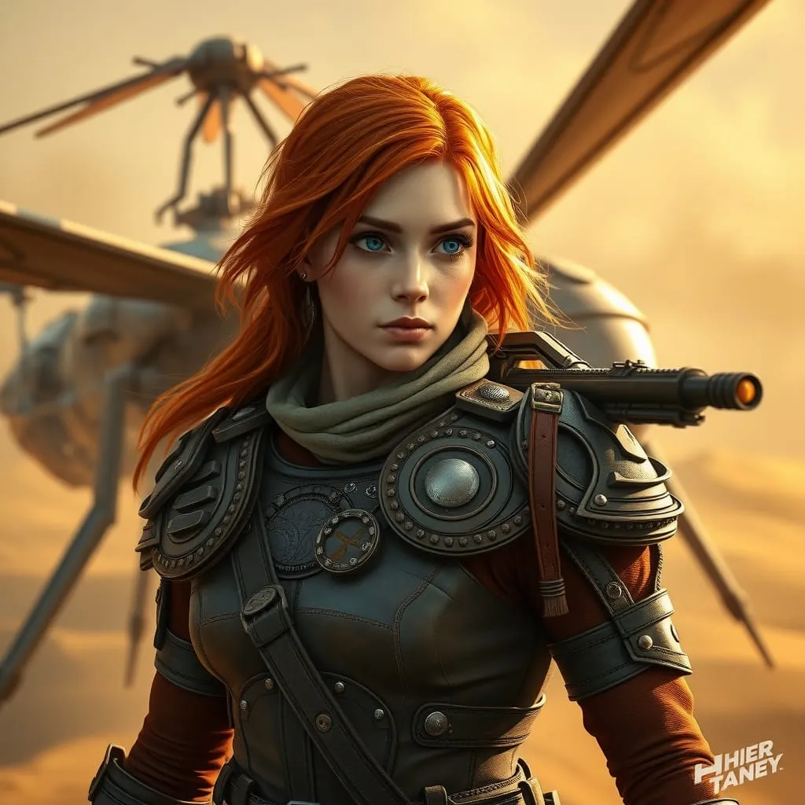
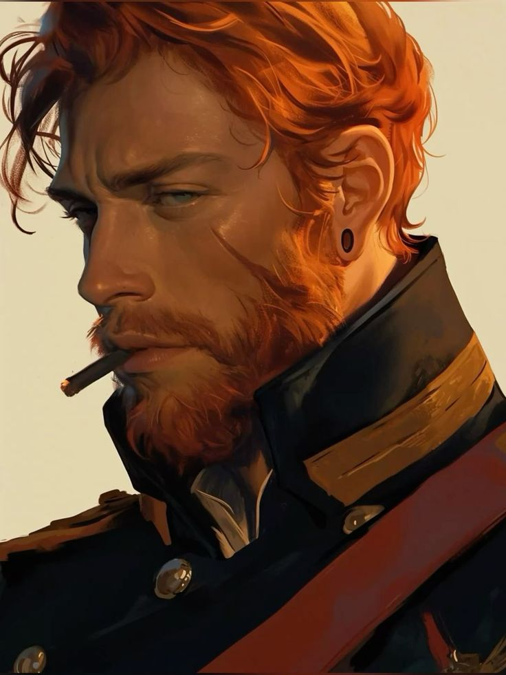
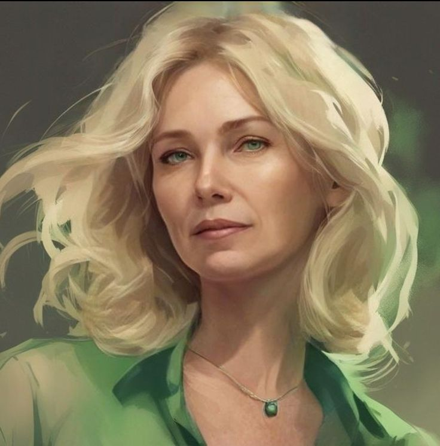
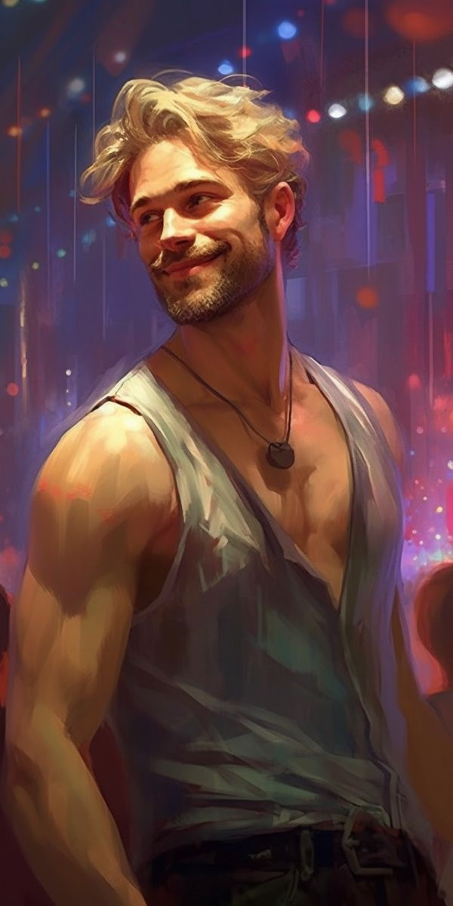
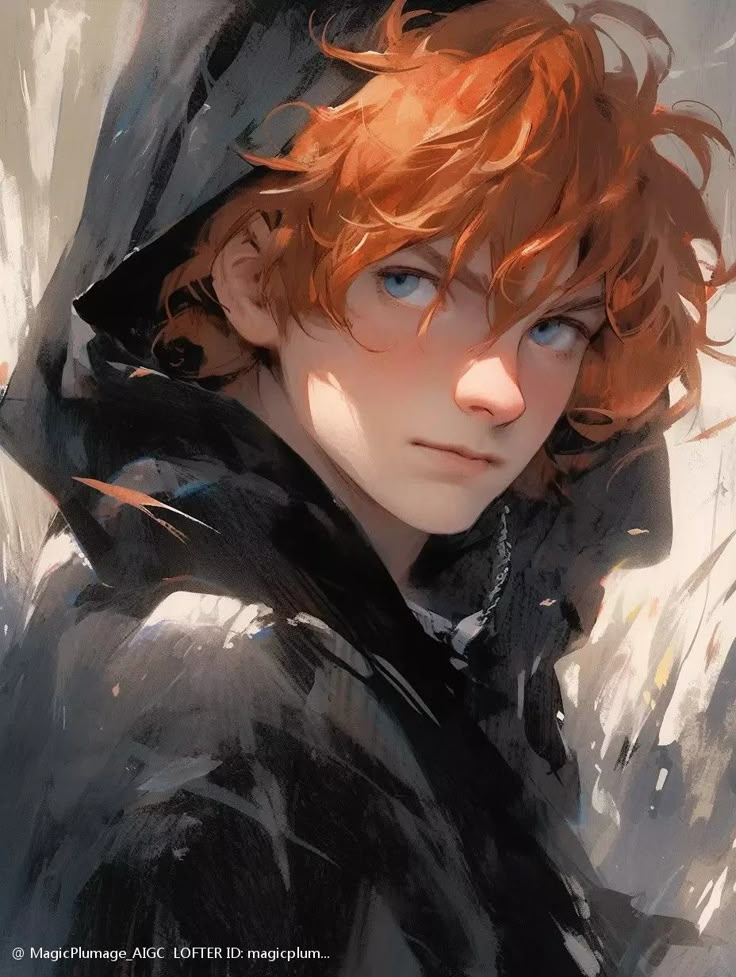
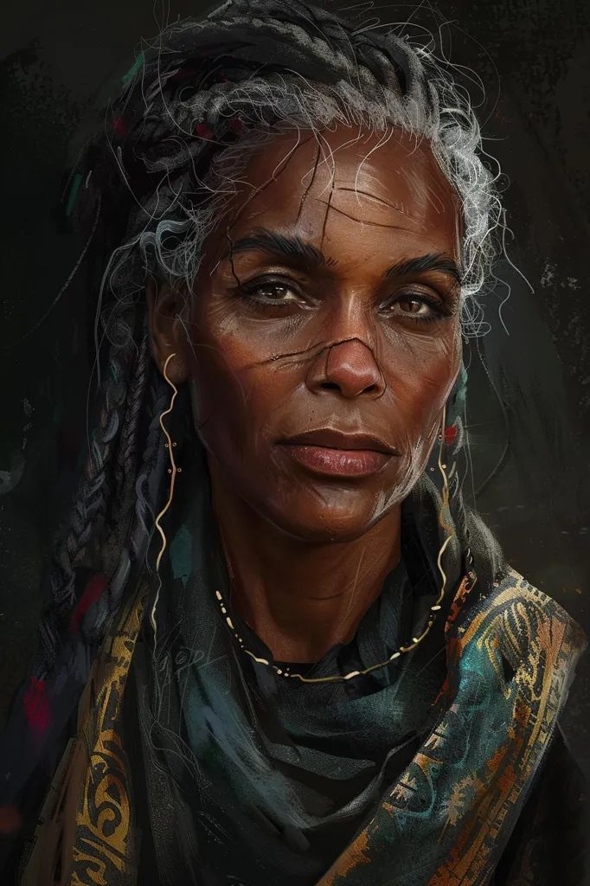

## wichtige personen

Eltern:

Mutter: Elaine (+23y)

Vater: Aaron (+21y)

Brüder: Jasper (-2y), Nicolai (-4y)

Mentorin: Catina Löw (+26y)

Mentor und „Arbeitgeber“: Teagan Stratfort

## Historie

- ihre Eltern haben sich in der Ausbildung kennen gelernt
- auf Richese geboren
- ist die Älteste von 
- hat 2 kleine Brüder
- ist von Kind auf begeistert von Fluggeräten/Flugzeugen und wusste schon früh das sie Pilotin werden wollte 
- hat von ihrer mentorin gelernt das auch mechanik kenntnisse wichtig sind da man so (kleinere) reparaturarbeiten selbst erledigen kann
- rebellische phase die mit 14 abrupt beendet wurde als sie ihren vater aaron und ihren bruder nicolai verlor; 
  ihre mutter wurde schwer verletzt und überlebte knapp; 
  jasper war zu diesem zeitpunkt bei einem freund und nicht dabei
  => Aaron, Elain und Nicolai waren gemeinsam einkaufen; sind auf dem rückweg in einen kampf zwischen Banden geraten
- hat danach eine Stelle im Haus Ayken angenommen (und sich nach und nach hochgearbeitet)
  - ist durch die Kammer des Aufstiegs gegangen
- hat mit 18 die Ausbildung als Pilotin angefangen
- wurde mit 22 von Teagan als persönliche Pilotin angestellt und von ihm weiter ausgebildet
  - hat viel von ihm gelernt und ihr Flugstil ähnelt dem von Teagan sehr
- mit 34 in die direkten Dienste von Glenn Ayken getreten weil Teagan bei einem Giftanschlag ums Leben gekommen ist
  - auch als persönliche Pilotin und Leibwächterin
  - hat von Teagan einen Thopter zusammen mit den Werkzeugen und Hangar 2 vermacht bekommen

- sie ist Lieutnant
- ist mit Hatrol Zachory vom Haus Atredis zusammen 

## Thopter
- von außen sieht er aus wie jeder andere
- Name: Rosi
- kein Hoheitsabzeichen außen am Thopter (habe für die reise nach kaitan welche aufgemalt)
- hat nen Transponder
- kann relativ fix den raketenträger auf atomwaffen umstellen
- von innen:
  auf der (mittel)konsole findet man ein kleines Bild von Lumis Familie
  auf einer der Kisten ist das Wappen vom Haus Ayken drauf
  von außen sind die Schränke und Kisten nicht weiter aufgehüscht worden
  an den innenseiten der Schranktüren wiederum kann man finden: Schemazeichnung von einem Topter, Schweber und Bildern von einem Heighliner und der Flora von Richese und Rossak

## Charakter/Beschreibungen
- läuft wenn möglich immer in lang ärmeliger Kleidung
- ist ein ordentlicher mensch
- hat auf der rechten Schulter einen Thopter und links 4 Finger breit unterm Schlüsselbein zwei Rosen tattoowiert
- unter Freunden ist sie fröhlich und aufgeschlossen; quirlig
- bei der Arbeit geht sie pflichtbewusst ihren Aufgaben nach
- hasst es Kleider zu tragen und macht es nur gegen Bezahlung/Bestechung
- Hobbies: Schrauben, Fotografieren, Zeichnen
  - Stand Anfangs 2 Jahre unter höchster Beobachtung weil ich sehr präzise unteranderem die Gärtner fotografiert habe
  - Lieblings-Motive: Flugzeuge, Blumen
Motivation: 
- mag den Adrenalienrausch beim fliegen und das Gefühl gebraucht zu werden
- möchte eine eigene Flotte haben mit passenden Fahrzeugen und Raumschiffen für jede Situation

-> Macht - Ich bin die die im Schatten wandelt, das Leben meines Schützlings liegt in meiner Hand.

## NSCs

### Aaron Braig 

- hat zwei ältere Geschwister: Jordan, Theo
- Vater von Lumi
- Ehemann von Elain
  - ist zwei Jahre jünger als Elaine
- im Alter von 35 verstorben
  - ist mit Nicolai und Elaine in einen Kampf zwischen Banden geraten 
- auf Richese geboren
- viele Familienmitglieder sind/waren im Militär 
- ist der Familientradition folgend auch ins Militär eingetreten
- Hobbies: Zeichnen, Kochen
- Persönlichkeit: freundlich, abenteuerlustig, diszipliniert
- Beruf: Soldat

### Elaine Braig

- hat drei jüngere Geschwister: Camilla, Carlos, Amalia
- Mutter von Lumi
- Ehefrau von Aaron
  - ist zwei Jahre älter als Aaron
- auf Richese geboren
- ist entgegen dem Wunsch ihrer Eltern dem Militär beigetreten
  - hat danach den Kontakt zu ihrer Familie abgebrochen
  - hat dort Aaron kennen gelernt
- seit dem Bandenvorfall körperlich eingeschränkt
- Persönlichkeit: charmant, aufgeweckt, diszipliniert
- Hobbies: Klettern, Häkeln
- Beruf: Soldatin
- wohnte in Raschan; ist mit nach Rossak umgezogen
- arbeitet in der Waffenfertigung in der Feuerspitze

### Jasper Braig

- kleiner Bruder von Lumi
- das zweite Kind von Aaron und Elaine
- ist mit seiner freiheitsliebenden Art immer wieder angeeckt
- hat es nicht gut verkraftet das sein Vater und sein Bruder verstorben sind
  - ist seit dem immer wieder mit seiner Mutter und Lumi aneinander geraten
  - hat sich sobald er konnte gelöst und sich selbständig seinen eigenen Weg gesucht
- Persönlichkeit: arrogant, freiheitsliebend, chaotisch
- Hobbies: Tanzen gehen, Geschichten schreiben
- Beruf: Händler
- das "schwarze Schaf" der Familie
- Luni hat kein gutes Verhältnis zu ihrem Bruder Jasper
- Reist gerne und ist beruflich häufig an anderen Orten
- wo Jasper ist, ist unklar

### Nicolai Braig

- kleiner Bruder von Lumi
- das jüngste Kind von Aaron und Elaine
- im Alter von 10 Jahren verstorben
  - ist mit Nicolai und Elaine in einen Kampf zwischen Banden geraten 
- Hobbies: Zeichnen, Lesen
- Persönlichkeit: dickköpfig, frech, clever

### Catina Löw

- Mentorin in Lumis Kindheit
- Beruf: Pilotin
- Hobbies: Schrauben, Karten spielen
- Persönlichkeit: selbstbewusst, sorgfältig, temperamentvoll
- auf Richese geboren
- ihre Eltern waren Piloten
  - hat sie im Alter von 10 Jahren verloren
  - ist danach mehr oder minder in den Hangars aufgewachsen und hat wo sie konnte mitgeholfen
- hat sich ihren Platz für die Piloten Ausbildung hart erarbeitet (Stipendium?) 
- hat Lumi schon früh unter ihre Fittiche genommen 
- kennt Lumis Eltern durch ihren Beruf

## offene Fragen
wo sind ihre mutter und ihr bruder gerade?

sind berufswechsel möglich? 
  was macht ihre mutter beruflich? -> schreibtisch täterin?

wie realistisch ist das man als händler von welt zu welt reist?

wie frei ist die berufswahl?

muss ich den vorteil toxinresistenz via char hintergrund belegen können? 

---

---

Teagan war für dich ein Mentor und Protege. 
Er hat dich irgendwann mal aus der Flugausbildung geholt und gesagt das du ab sofort seine Pilotin bist. 
Er selber hat dir auch noch Kniffe beim fliegen gezeigt auch wenn du heutzutage besser an den Kontrollen bist als er. 
Aka er hat dich als du grade frische Flugschülerin warst angefordert und dir eine eigene Maschine gegeben bevor die anderen auch nur das erste mal in einem nicht simulierten Cockpit sitzen durften.

es ist aktuell ungewöhnlich das er dich schon so lange nicht angefordert hat. Normalerweise hast du ihn 2-3 mal am tag irgendwohin geflogen oder begleitet. Du weist natürlich nicht das er tot ist.
Als du nachschaquen warst war Teragan nicht in seinem Quartier (oder hat dir nicht aufgemacht). Sein Adjutant und Leibdiener Major a.D. Linus Hardtman ist für dich ebenfalls nciht auffindbar. 
Eventuell ist er mit ihm allein auf einer Mission.

Linus Hardtmann selbst ist auch schon um die 70. Äußerst bedacht und militärisch korrekt. 
Er hat wenn man unter sich ist einen recht trockenen Humor, der allerdings nciht zu leugnen ist. Brillianter Nahkämpfer und Stratege

Wortlaut des Dokumentes:
"Da ich weis das sie eine eigene Flotte führen möchte vermache ich Leutnant Lumi Braig meinen Thopter, die Werkzeuge und Hangar 2. Möge dies der Grundstein für eine Flotte unter der Flagge des Hauses Ayken sein."

OT: die Frau ist knapp über 30. Die Pilotenausbildung findet normalerweise so im alter zwischen 18 (frühestens) und 22 (spätestens) statt

12 Jahre lang mittlerweile.
mit 22 hat er dich aus der Ausbildung eingesammelt
es gab auch gemeinsame Feiern nach schwierigen Missionen

---
Turbolader
Panzerbrechende Munition

nicht wirklich abgedeckt:
Raumfahrt, Steuern, Sicherheit, Schießen

Pilot? mit mehr z.b. leibwache (von tiegen)
gerne Kampfkompetenz (fernkampf wenns geht)
adjutant
sicherheitsaspekt?

für nen guten einstieg: 
- char idealerweise aus dem haus/personal
- eingekauft (?)

muss vertrauenswürdig sein/als vertrauenswürdig eingestuft werden von hochrangigem personal
-> sollte vorher schon viel um hochrangige mitglieder herum gewesen sein

---

Funktion: Pilot & Leibwächter/Kämpfer
Persönlichkeit:
- quirlig und aufgeschlossen im Freundeskreis außerhalb der Vorgesetztenstruktur
- eher Pflichtbewusst wenn bei der Arbeit

wenn von Teagan:
habe nicht viel besitz weil ich ne bürgerliche bin
könnte den topter von teagen vermacht bekommen und konnte vorher immer dran rum schrauben 

Wahrheit - Am Steuer bin ich frei, da ich bestimme wohin der Wind uns weht.

motto des hauses:
wer schwache zurück lässt ist abschaum

Thopter:
war mal ein truppentransporter
habe ein paar sitze rausgeschmissen und einen kleinen wohnraum eingebaut
2 leute können schlafen 

habe eine uniform hergestellt von bludd bekommen

# Bau Zeug

---

## Motivations Vorteil
### Kategorie
Pflicht
Glaube
Gerechtigkeit
Macht
Wahrheit

Die Wirkungsdauer einer Kraft, die nicht Wirkungsdauer Sofort hat, wird um 10 Ticks verlängert.

Atletik 3 -> 9/4 -> 16
Infiltration
Medizin
Survival
Netzwerken
Überreden
Sicherheit
Nahkampf

Steigerungstabelle
0->1 | 2
1->2 | 4
2->3 | 6
3->4 | 8
4->5 | 10

max 2 vorteile mit hintergrund
max 25EP+

## vor- & nachteile
vorteil:
blitzreflexe 6
toxinresistenz 5
unauffälligkeit 6
(flüchtling 3 - H )
militärgöre 3 - H
20/23

nachteile
Allergie 4 + stufe x2
eingeschränktes attribut 8 -> Persönlichkeit
loyal 3

Vorteil:
alleskönner 5
(begabung 8)

fotografisches gedächtnis 2
herausragender sinn 3
kräftig 6

robust 8 
schnellheilung 12
(straßenkind 3 - H)
veteran 3 - H

Nachteil:
(fernweh 6)
flashbacks 8
(gezeichnet 5)
neuguerig 3
schlafstörung 10
tick 3

vorurteile 6

5 talente free
max 10

kampfsprache
abdrehen
gunslinger
Schildkalibrierung
schnell ziehen
strenge kontrolle
bewusste Bewegung
gefahreninstinkt
passive überprüfung/(immer wachsam)

????
priority boarding
logik

# allgm.

# kampf
ausweichen/()
(entschlossnes handeln)

(große reichweite)

(kühler Kopf)

# kraft
gildenmitglied
???
(reserven)
sekundär waffe

# sozial
(faktenwissen)
(jemanden zu bekämpfen bedeutet ihn zu kennen)

Kühler Kopf
Voraussetzungen: Kognition 3+ oder Persönlichkeit 3+
Er für die Berechnung der Initiative das Reflexe-Attribut gegen Kognition ersetzen. -> fehlte ein wort?

